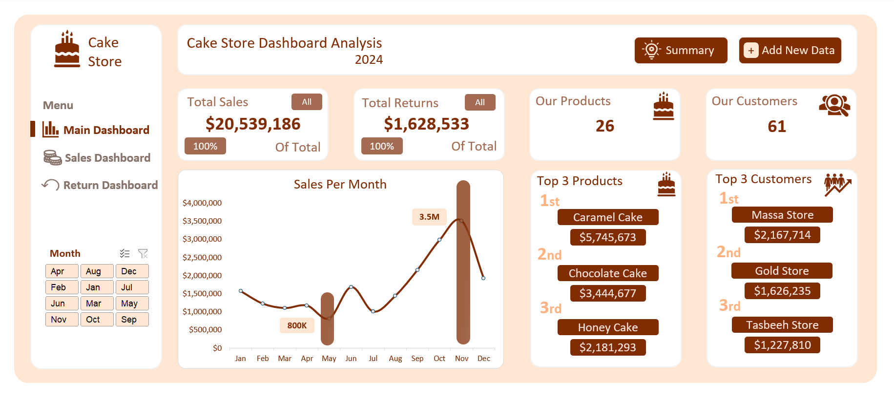
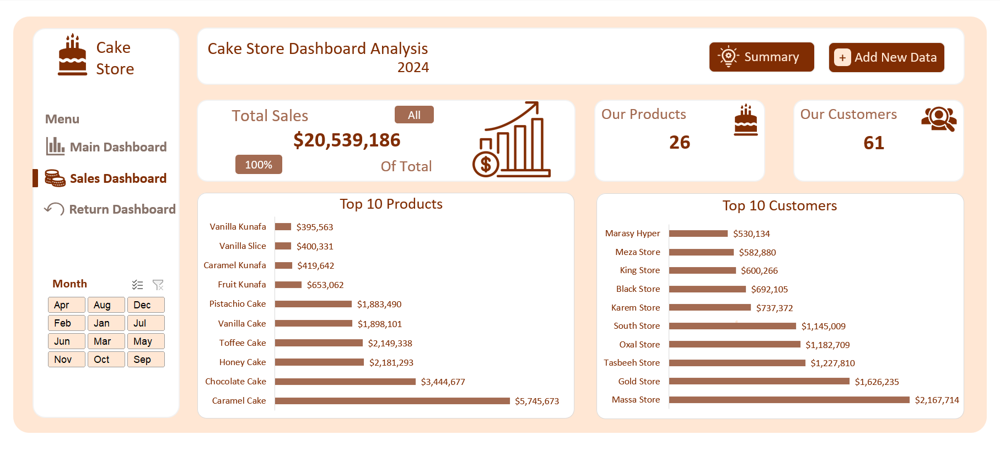
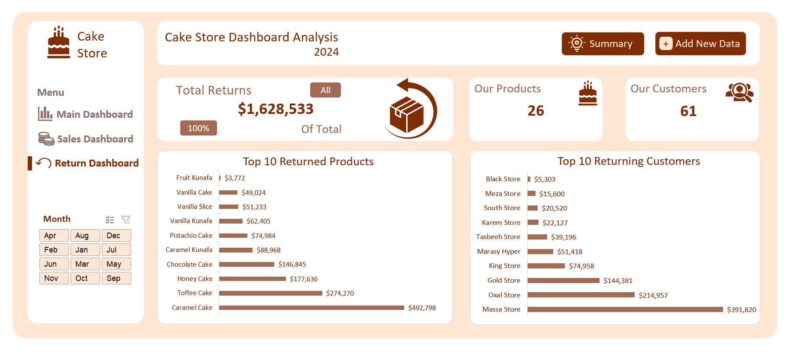
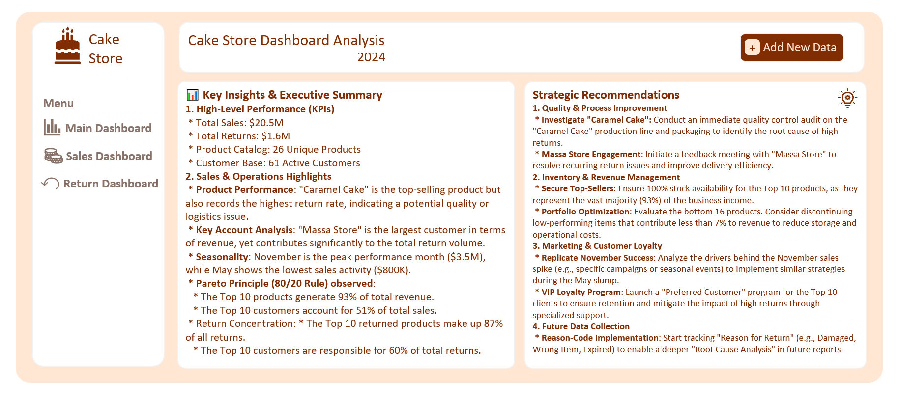

# Sales Performance & Supply Chain Analysis
## Project Overview:
This project provides a comprehensive analysis of sales performance and product returns for a retail business. The goal is to identify revenue drivers, analyze the high return rates of top products, and provide actionable strategic recommendations to optimize operations.

## Key Insights (Executive Summary)
* **Total Revenue:** $20.5M
* **Total Returns:** $1.6M
* **Product Performance:** 10 products generate **93% of total revenue**.
* **Peak Month:** November ($3.5M).
* **Critical Issue:** The top-selling product ("Caramel Cake") and the top customer ("Massa Store") both exhibit disproportionately high return rates.

## Tech Stack
* **Data Analysis:** Excel (Pivot Tables).
* **Visualization:** Excel.
* **Documentation:** Markdown.

## Dashboard Highlights
* **KPI Tracking:** Real-time monitoring of Sales, Returns, and Customer Activity.
* **Pareto Analysis:** Focused view on the Top 10 products and customers.
* **Seasonality Trends:** Monthly sales performance comparison

## Strategic Recommendations
1.  **Quality Audit:** Investigate "Caramel Cake" production and logistics.
2.  **Customer Relations:** Targeted feedback sessions with "Massa Store".
3.  **Inventory Optimization:** Focus on the Top 10 products; evaluate the bottom 16 for potential discontinuation.
4.  **Process Improvement:** Implement "Return Reason Codes" for better future RCA (Root Cause Analysis). 

## Dashboard Screens

